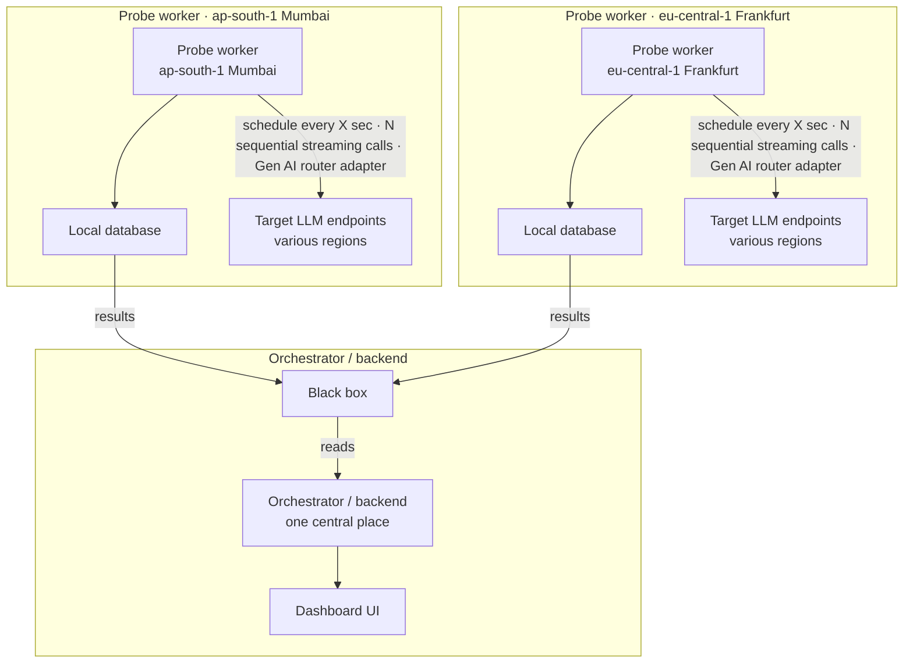

# 5. Scheduled collection + Result Sink (supersedes ADR 0002)

Date: 2026-06-22

## Status

Accepted. Supersedes [ADR 0002](0002-orchestrator-and-probe-workers.md).

## Context

ADR 0002 had the central Orchestrator make an inbound `POST /measure` call *into* each
Probe Worker. That is not deployable: the worker pods run inside locked-down prod /
FedRAMP clusters that **block inbound connections**. Nothing external — not the
Orchestrator, not a user — can reach into a pod.

The worker pod *can* run on its own and call the target LLMs directly. The open
question was how a Run is triggered (since nothing can call the pod) and how results
reach a central place for cross-region comparison.

We considered five shapes (trigger × how results get central):

- **A** — pod polls a shared DB for pending Runs, writes results to it.
- **B** — pod polls a central API, posts results to it.
- **C** — a human inside the region triggers the pod; results go to a central DB.
- **D** — pod self-triggers on a schedule; results go to a central store.
- **E** — pod fully isolated (LLM egress only); each pod has its own UI + local
  storage. Rejected: no central store means no cross-region comparison, which is the
  product's entire purpose.

Direction from the stakeholder: workers **collect on a configurable interval**, and the
exact transport that moves data to the central place is intentionally left as a **black
box** (Snowflake, a proxy, or plain HTTPS — decided later). That is option **D** with
the egress abstracted behind a seam.

## Decision

1. **Scheduled collection replaces on-demand Runs.** Each Probe Worker triggers itself
   on a configurable interval. The interactive "run now" path and the
   Orchestrator → Worker `POST /measure` contract are removed. The dashboard becomes
   **read-only** (latest + historical comparison).

2. **Collection Scope is per-worker, via environment** (alongside `SOURCE_REGION` and
   credentials), not in the shared catalog:
   - `COLLECT_INTERVAL_SECONDS`
   - `COLLECT_MODELS` (CSV; unset → all catalog models)
   - `COLLECT_TARGETS` (CSV; unset → all catalog target regions)

   The shared catalog shrinks to **shared facts only**: `prompt`, `models`,
   `target_regions`, and region labels. `worker_url` / `worker_url_env` are removed.

3. **A Run stays per `(Source Region, Model)` per cycle**, with one Sample per Target
   Region — identical to today's `RunDTO`. A cycle measuring M models emits M Runs.
   Each Run carries a worker-generated `run_id` (UUID) for idempotent de-duplication on
   the central side.

4. **Results leave through a `Result Sink` seam** — the same pattern as the existing
   `Provider Adapter`. The Worker calls `sink.export(run)` and never knows the
   transport. Implementations are selected by `RESULT_SINK`:
   - `snowflake` (default) → Snowflake SQL REST API (`LATENCY_RUNS` MERGE)
   - `stdout` / `jsonl` → for tests and dry runs
   - `noop` → discard

See [`docs/architecture.md`](../architecture.md) for the Mermaid diagram (same layout as the original two-region drawing).

## Consequences

- **No inbound to the pod, ever.** Every pod connection is outbound (to LLMs and to the
  Sink), which satisfies the cluster constraint.
- **The Orchestrator stops orchestrating.** It only serves the read-only dashboard and
  the stored Runs; it no longer imports `httpx` or calls workers. The name is kept for
  continuity (see CONTEXT.md).
- **`worker_app.py`'s `POST /measure` is removed**; the worker becomes a scheduled
  process (a collector), not an HTTP service.
- **`probe.py`, `schemas.py`, storage shape, and the Sample/Run model are unchanged** —
  only the trigger and the destination move.
- **Kind sim and prod** both use Snowflake: workers `RESULT_SINK=snowflake`, orchestrator `RUNS_STORE=snowflake`.
- The catalog loses `worker_url*` and per-source scope; tests and `catalog.prod.json`
  must drop those fields.
- Config drift risk: scope now lives in 13 deploy envs rather than one file. Accepted —
  the dashboard shows what is *actually* measured from the arriving Samples, so observed
  scope is self-documenting.

## Test strategy

Follows the repo's grill → test → code → test → push loop. First slices are unit tests
with no credentials and no network:

- **Result Sink**: a `FakeSink` records exported Runs; assert the scheduler emits one
  Run per `(source, model)` with a Sample per target.
- **Scope resolution**: given `COLLECT_MODELS` / `COLLECT_TARGETS` / unset, assert the
  resolved `(model × target)` matrix (RED before the resolver exists, then GREEN).
- **Scheduler loop**: mock the probe + clock; assert it fires on interval and exports.
- **Orchestrator**: assert it serves stored Runs and no longer exposes a create/dispatch
  path.
