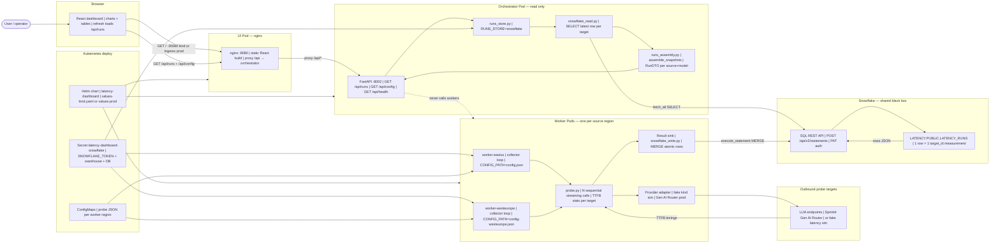
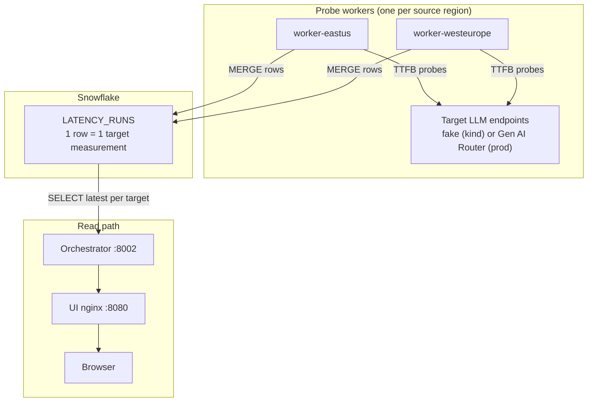

# Latency Dashboard — Architecture

Box-and-arrow view of the deployed system (ADR 0005). Supersedes the inbound-dispatch design in ADR 0002.

**Rule:** nothing calls *into* a probe pod. Every pod connection is **outbound** (to LLMs and to Snowflake).

**Black box:** Snowflake table `LATENCY.PUBLIC.LATENCY_RUNS` via SQL REST API + PAT.

---

## 0. End-to-end system diagram

Overall structure (kind sim or production Kubernetes — same pod layout):



| Subgraph | Role |
|----------|------|
| **Browser / UI pod** | Read-only dashboard; nginx serves React and proxies API |
| **Orchestrator pod** | Reads Snowflake, assembles snapshots, serves JSON |
| **Worker pods** | Scheduled outbound probes; write one row per target per cycle |
| **Snowflake** | Single source of truth for all regions |
| **Kubernetes deploy** | Helm + Secret + ConfigMaps; no inbound traffic to workers |

---

## 1. System overview

**Workers** (one per source region) probe LLM endpoints on a schedule and write atomic rows to Snowflake. **Orchestrator** reads Snowflake and assembles dashboard snapshots. **UI** serves React and proxies `/api` to the orchestrator.



---

## 2. Inside one probe worker pod

```
   ┌─────────────────────────────────────────────────────────────────┐
   │  Probe worker pod (Kubernetes Deployment)                       │
   │                                                                 │
   │   ConfigMap → config.json (source_region, llm_configs, provider) │
   │                                                                 │
   │   ┌──────────────┐    every collect_interval_seconds            │
   │   │  Scheduler   │ ─────────────────────────────────────┐      │
   │   └──────────────┘                                      │      │
   │                                                         ▼      │
   │   ┌──────────────────────────────────────────────────────────┐ │
   │   │  For each target_id: N streaming calls → TTFB stats      │ │
   │   └───────┬──────────────────────────────────────┬───────────┘ │
   │           │ Provider Adapter                     │             │
   │           ▼                                      ▼             │
   │   ┌───────────────┐                    ┌─────────────────┐   │
   │   │ Target LLMs   │                    │ Result Sink     │   │
   │   │ (outbound)    │                    │ snowflake_write │   │
   │   └───────────────┘                    └────────┬────────┘   │
   │                                                 │             │
   │                                                 ▼             │
   │                                        Snowflake SQL REST API  │
   └─────────────────────────────────────────────────────────────────┘
```

Env: `RESULT_SINK=snowflake`, `SNOWFLAKE_*` from Kubernetes Secret.

---

## 3. Kind sim (local Kubernetes on Mac)

Same pod layout as prod; images built locally and loaded into kind. UI exposed via NodePort **30080** + `deploy/kind/kind-config.yaml` host mapping.

```
  Mac :30080 → kind node :30080 → UI Service → UI pod :8080
                                              → /api proxy → orchestrator :8002
```

Deploy flow: [`deploy/kind/README.md`](../deploy/kind/README.md).

Uses fake provider configs for probes; **real Snowflake** for storage.

---

## 4. Production Kubernetes

One worker Deployment per source region (each in its region’s cluster or namespace). Same Helm chart as kind; differences:

| | Kind sim | Prod |
|---|----------|------|
| Images | `kind load` locally | Container registry |
| Secrets | `create-snowflake-secret.sh` | Vault / cloud secret manager |
| UI access | NodePort / port-forward | Ingress / Load Balancer |
| Probe config | `config.json` (fake) | `config.prod.json` (Gen AI Router) |
| Collect interval | `collect_interval_seconds` in config | Same (typically 300s+) |

```
   ┌──────────────── region A cluster ────────────────┐
   │  worker (source=A) → Snowflake MERGE           │
   └────────────────────────────────────────────────┘

   ┌──────────────── region B cluster ────────────────┐
   │  worker (source=B) → Snowflake MERGE           │
   └────────────────────────────────────────────────┘

   ┌──────────────── central / shared cluster ──────┐
   │  orchestrator + UI → Snowflake SELECT          │
   └────────────────────────────────────────────────┘
```

Workers never receive inbound traffic from the orchestrator or UI.

---

## 5. Read path and assembly

Snowflake stores **atomic rows** (one per `run_id` / target). The orchestrator:

1. `SELECT` latest row per `(source_region, model, target_id)`
2. `assemble_snapshots()` in `runs_assembly.py` → one `RunDTO` per `(source_region, model)`
3. JSON to UI via `GET /api/runs`

Snapshot id: `{source_region}::{model}`.

---

## 6. Swappable seams

| Seam | Env / config | Role |
|------|--------------|------|
| **Source identity** | `source_region` in config | Where this worker runs |
| **Provider Adapter** | `provider` in config | `fake` (kind) or `gen-ai-router` (prod) |
| **Result Sink** | `RESULT_SINK=snowflake` | Write path to Snowflake |
| **Runs store** | `RUNS_STORE=snowflake` | Read path from Snowflake |
| **Collection scope** | `llm_configs[]`, `collect_llm_configs` | Which targets this pod measures |

---

## 7. Data model

**Stored (Snowflake):** one row per target per collect cycle.

**Served (API/UI):** one run per `(source_region, model)` with `samples[]` for all targets.

```
   Collection cycle
        │
        ├── row: source=eastus, target=eastus,   model=gpt-4.1
        ├── row: source=eastus, target=westeurope, model=gpt-4.1
        └── row: source=eastus, target=ap-south-1, model=gpt-4.1
                    │
                    ▼ assemble_snapshots()
              RunDTO id=eastus::gpt-4.1, samples=[...]
```

---

## Related docs

- Domain language: [`CONTEXT.md`](../CONTEXT.md)
- Kind deploy: [`deploy/kind/README.md`](../deploy/kind/README.md)
- ADR 0005: scheduled collection + result sink
- ADR 0006: Gen AI Router adapter
